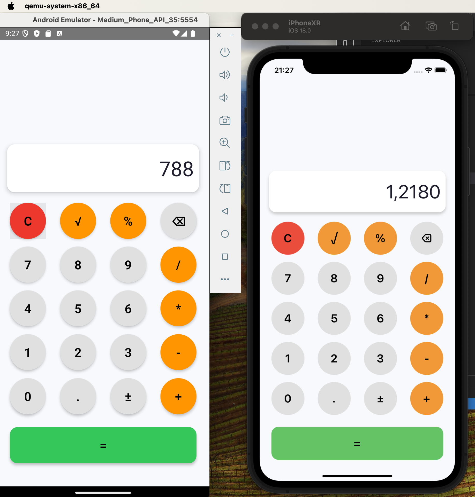

# Calculator App

This is a simple calculator app built with React Native.

## Step 1: Set Up Your Project
npx react-native init CalculatorApp

## 2. Navigate into your project:
cd CalculatorApp

## Step 3: Run Your App
npx react-native run-android
-
npx react-native run-ios

